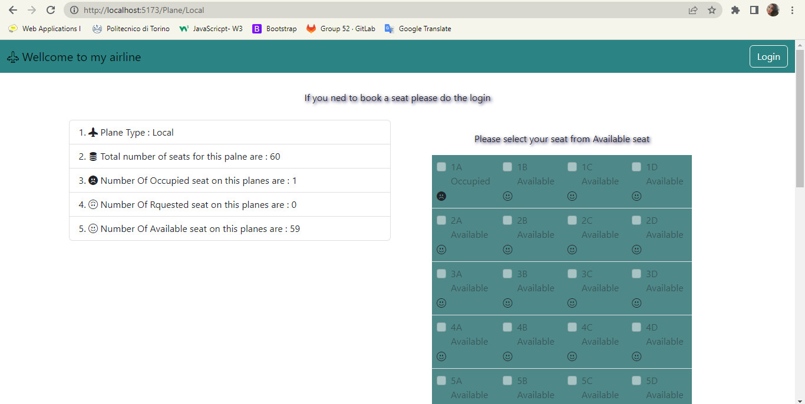
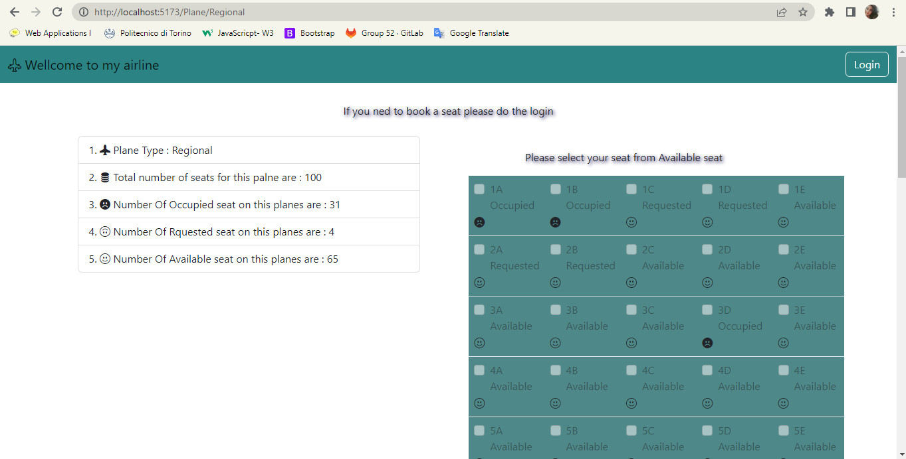
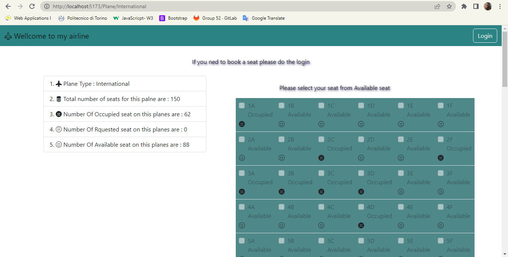
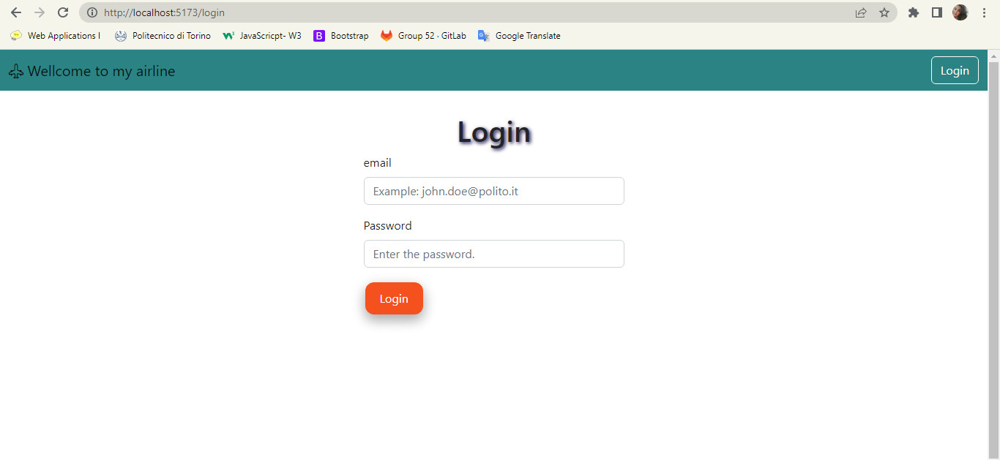
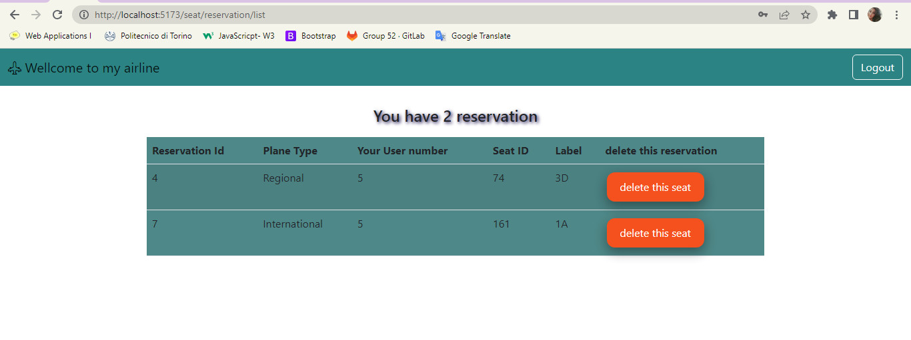
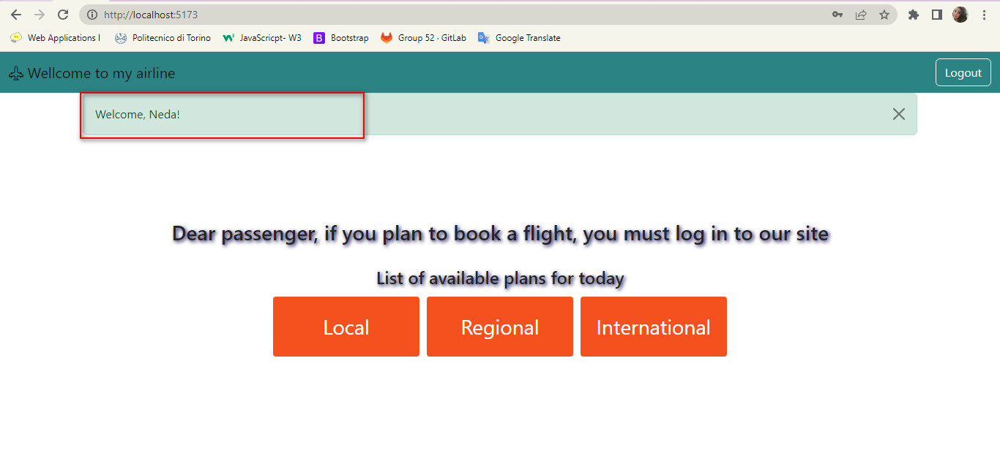
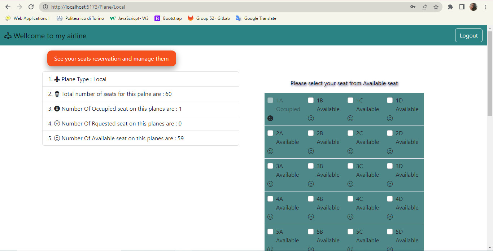
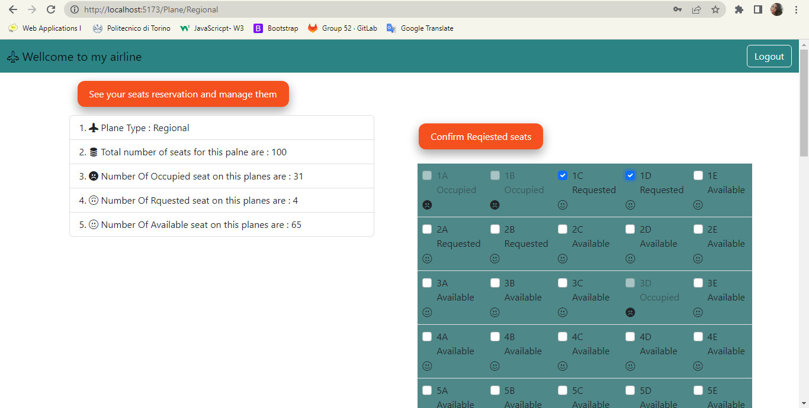
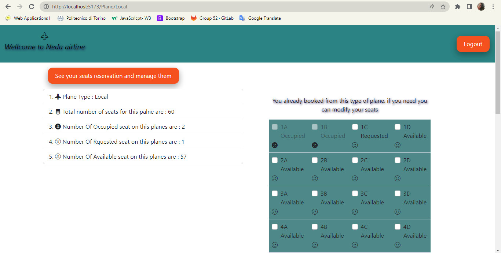

## React Client Application Routes

- Route `/`: The mail page that non-authenticated user can see. This page Contain 3 button to show available plane

- Route /login : The page that user can enter email and password to login
- Route `Plane/Local`: The page that a user can see the seats related the Local palne and do action if she is authenticated. If user is not authenticated can only see the status of seats. 

- Route `Plane/Regional`: The page that a user can see the seats related the Regional palne and do action if she is authenticated. If user is not authenticated can only see the status of seats. 

- Route `Plane/International`: The page that a user can see the seats related the International palne and do action if she is authenticated. If user is not authenticated can only see the status of seats. 

 - Route /seat/reservation/list/ : This page shouws the number of user reservation

## API Server

Get all seat for a specific plane type

- GET `/api/plane/${planeType}`
- Description: This API will get a parameter that this parameter is the type of plane and will retrieve all seats in the database that have the same type with the parameter
  - request parameters : {planeType}
  can be :  
  { Local 
    Regional 
    International}  

  - response body:
   [
    {
        "seatId": 61,
        "planeType": "Regional",
        "row": 1,
        "column": 1,
        "status": "Available"
    },...
   ]

Get all (Available/Occupied/Requested) seat for a specific plane 

- Description: This API takes 2 parameters that are planeType and status and will retrieve all seats from the database that have the same type with planeType and have the same status with status. For example, you need the number of all available seat in the Local palne, you can send request like : api/plane/Local/Available

- GET /api/plane/${planeType}/${status}
- request parameters : {planeType} {status}
    planeType: {Local/Regional/International}
    status: {Available/Requested/Occupied}
    - response body:
        [
    {
        "seatId": 61,
        "planeType": "Regional",
        "row": 1,
        "column": 1,
        "status": "Available"
    },...
    ]

Change the status of a seat to Requested
- Description: This API will get a seatId and then change the status of that seat to status="Requested" in the database
- POST `/api/plane/:id`
  - request parameters and request body content : {seatId}
  - response body content : the previouse seat with the status equal to "Requested"
  [
    {
        "seatId": 61,
        "planeType": "Regional",
        "row": 1,
        "column": 1,
        "status": "Requested"
    }
    ]

Change the status of a seat to Available
- Description: This API will get a seatId and then change the status of that seat to status="Available" in the database
- POST `/api/availableplane/:id`
  - request parameters and request body content : {seatId}
  - response body content
-   [
    {
        "seatId": 61,
        "planeType": "Regional",
        "row": 1,
        "column": 1,
        "status": "Available"
    }
    ]
Change the status of a seat to Occupied
- Description: This API will get a seatId and then change the status of that seat to status="Occupied" in the database
- POST `/api/Occupiedplane/:id`
- request parameters and request body content : {seatId}
  - response body content
-   [
    {
        "seatId": 61,
        "planeType": "Regional",
        "row": 1,
        "column": 1,
        "status": "Occupied"
    }
    ]

Add a new Reservation
- Description: This API will get 4 parameter from a seat, then add  a new (reservation) rocord in database
- POST `/api/reservations`
- request parameters and request body content : { planeType, userId, seatId, label }
- response body content: 
[
  {
    "reservationId":1,
    "planeType":"Regional",
    "userId":5,
    "seatId":61,
    "label":"1A"
    }
]
Delete a reserved seat
- Description: Get 2 parameter from request and delete a reservet seat from database
- DELETE `/api/reservations/delete`
- request parameters and request body content : { userId , seatId } 
- response body content: []

Get Reserved seat for a specific user 
- Description: To get all reservet seat for a specific user
- GET /api/planes/reservation/${id}
- request parameters : req.params.id ;
[
    {
        "reservationId": 2,
        "planeType": "International",
        "userId": 5,
        "seatId": 180,
        "label": "4B"
    },
    {
        "reservationId": 4,
        "planeType": "International",
        "userId": 5,
        "seatId": 182,
        "label": "4D"
    },
]

Get user 
GET `/api/sessions/current`
- Description: check if current user is logged in and get her data
- Request body: None
- Response: 200 OK (success)
- Response body: authenticated user

DELETE `/api/session/current`
- Description: logout current user
- Request body: None
- Response: 200 OK (success)
- Response body: None
- Error responses: 500 Internal Server Error (generic error), 401 Unauthorized User (user is not logged in)

POST `/api/sessions`
- Description: authenticate the user who is trying to login
- request parameters and request body content : { credentials } 
- Request body: credentials of the user who is trying to login
- Response: 200 OK (success)
- Response body: authenticated user

## Database Tables

- Table `seat` - contains seatId PlaneType row column status
- Table `reservatin` - reservationId planeType userId seatId label
- Table `users` - contains id email name hash salt

## Main React Components

- `MainPagePlanes` (in `PlaneComponenet.jsx`): component contain a function that return 3 button for 3 type of plane. this is the main page that user can see. both authenticated or non-authenticate

- `PlaneType` (in `PlaneTypeComponent.jsx`): This component return a Table to show the seats and a box to show the number of Available/Occupied/Requested seats.

- `SeatTable` (in `PlaneTypeComponent.jsx`) : this component return TableData component. in this component based on the Type of plane a table will create with specific row and column.

- `TableData` (in `PlaneTypeComponent.jsx`): This component returns table data according to the status of the seats that are fetched from the Database. if the status of the seat was Occupied table data will be a disabled check box. if the status of the seat was available data will be a check box that is enable to check

- `Reservation` (in `ReservationList.jsx`) : This component returns a ReservationTable component that is a table to shouw the users reservation.  Also have a text.

-`ReservationTable` (in `ReservationList.jsx` ) : This component returns 6 table header and  ReservationRow component.

- `ReservationRow`(in `ReservationList.jsx` ) : Component return a row to create table. Also returns TableData component. 

- `TableData` (in `ReservationList.jsx`) : This component will return table data that come from database.

(only _main_ components are written , minor ones are skipped)

## Screenshot

## Users Credentials

-  Email: User1@polito.it, Name: Alis,  Password: User1polito (Salt: e818f0647b5e1e55 , Hash: 448a23940b28a621e09d47cf1ad1d1059918e9a9a763e16b1dc2f3eed08cd433 )

- Email: User2@polito.it,Name: Neda  Password: User2polito  (Salt: e818f0647b5e1e84 , Hash: e940071c38c9bdf75323327993684b6e9b89fb4c25f6521a649094e8220c8446)
